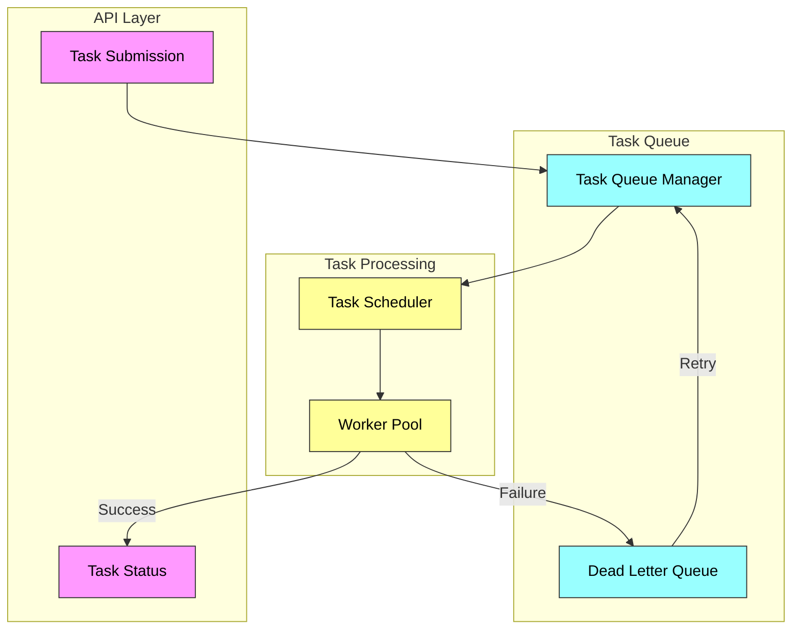

# Distributed Task Processing System

A scalable, fault-tolerant system for processing asynchronous tasks and messages. The system provides reliable task execution with built-in retry mechanisms, dead letter queue handling, and automatic scaling capabilities.

## System Architecture

##  Key Features

- **Task Types**:
  - HTTP Requests: Handle API calls and webhooks
  - Background Processing: Manage data transformation and batch jobs
  - Text Processing: Handle text-based messages and JSON/XML data

- **Reliability Features**:
  - Automatic retry with exponential backoff
  - Dead letter queue for failed tasks
  - Comprehensive error logging

- **Scalability**:
  - Automatic worker scaling based on queue size
  - Configurable rate limiting
  - Distributed task processing