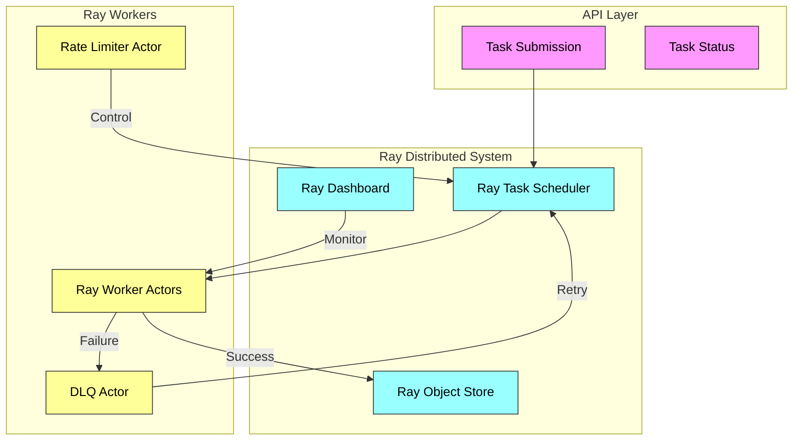

# Ray-Powered Distributed Task Processing Engine

A scalable, fault-tolerant system for processing asynchronous tasks and messages. The system provides reliable task execution with built-in retry mechanisms, dead letter queue handling, and automatic scaling capabilities. Now powered by Ray for distributed computing!

## System Architecture



##  Key Features

- **Ray Integration**:
  - Ray Actor-based task execution
  - Distributed object store for task state
  - Ray Dashboard for monitoring
  - Cluster auto-scaling

- **Task Types**:
  - HTTP Requests: Handle API calls and webhooks
  - Background Processing: Manage data transformation and batch jobs
  - Text Processing: Handle text-based messages and JSON/XML data

- **Reliability Features**:
  - Automatic retry with exponential backoff
  - Dead letter queue for failed tasks
  - Comprehensive error logging

- **Scalability**:
  - Ray-based worker scaling
  - Token bucket rate limiting
  - Distributed task processing

## Getting Started

### Local Development

```bash
# Install dependencies
pip install -r requirements.txt

# Run with local Ray
python -m src.main
```

### Docker Compose

```bash
cd deployment
docker-compose up -d
```

### Production Deployment

```bash
# Deploy to Kubernetes
cd deployment
./deploy.sh prod

# Or deploy to Ray cluster
DEPLOYMENT_TYPE=ray-cluster ./deploy.sh prod
```

## Monitoring

- **Ray Dashboard**: Available at `http://localhost:8265`
- **API Metrics**: Available at `http://localhost:8000/api/v1/system/status`
- **Prometheus & Grafana**: Included in the Docker Compose setup

## API Usage

See the API documentation at `/api/v1/docs` for detailed usage examples.